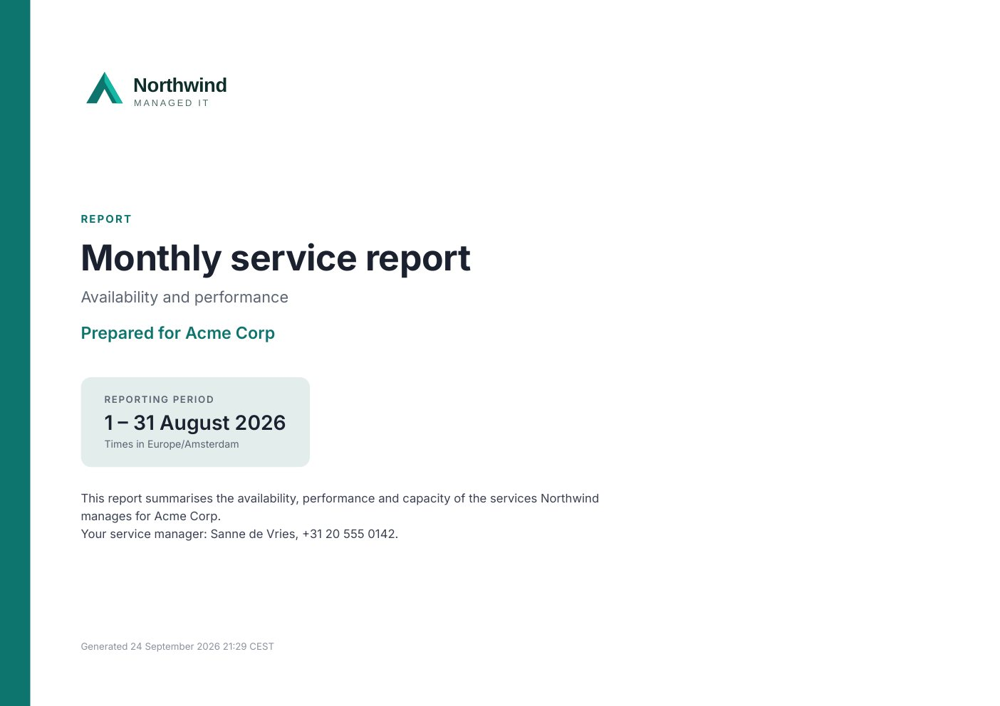
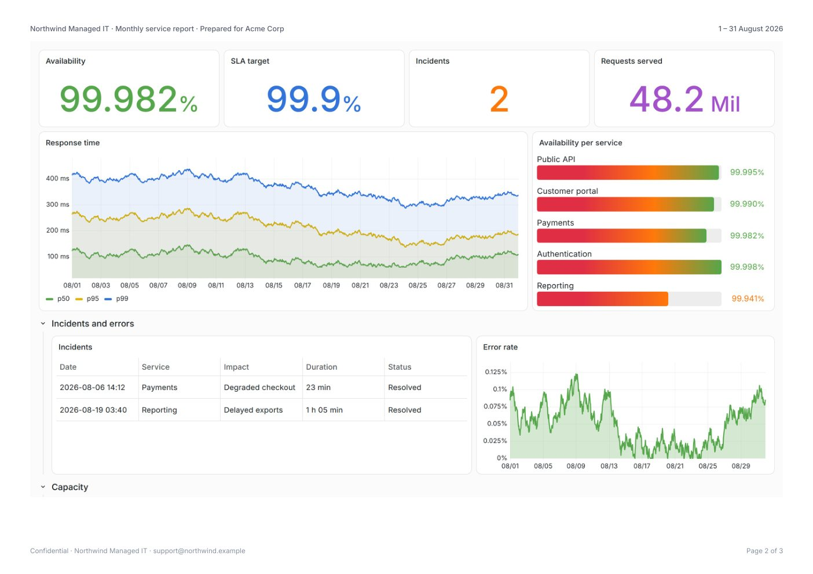
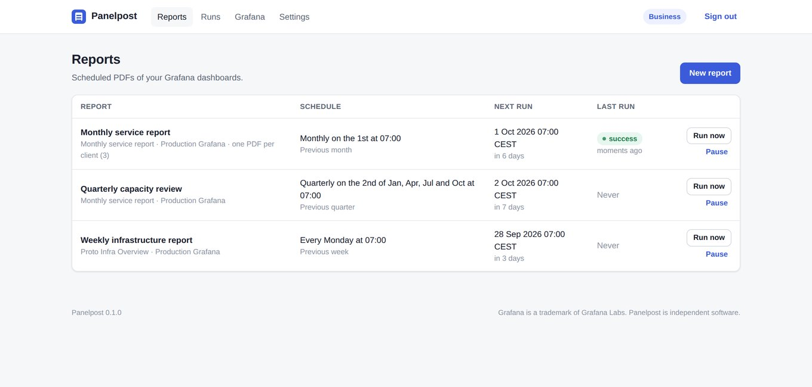
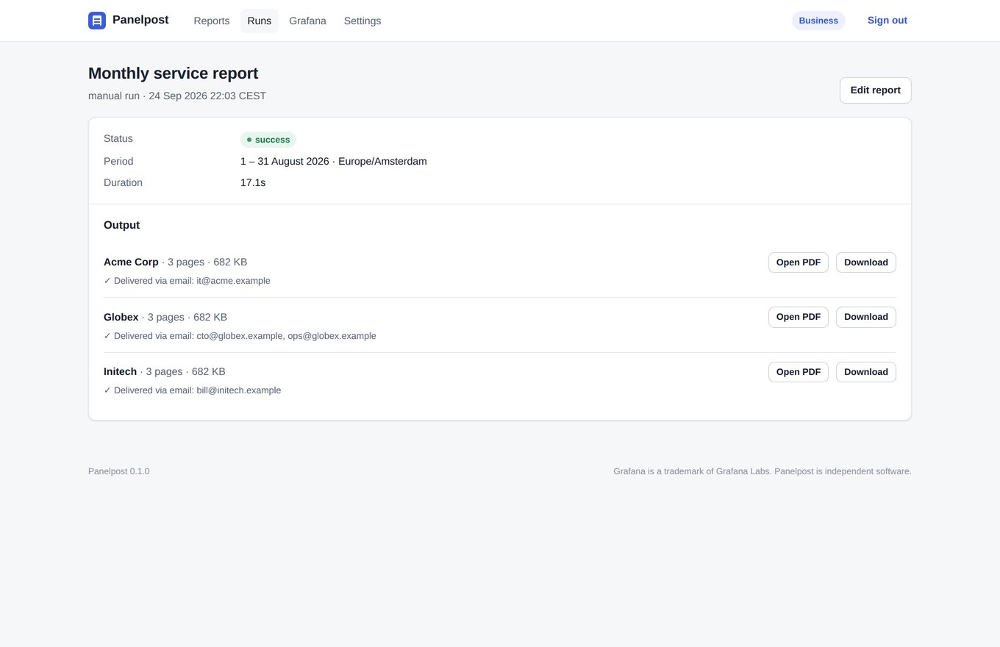

# Panelpost

**Scheduled PDF reports for Grafana OSS. No Enterprise license needed.**

Panelpost turns any Grafana dashboard into a polished, branded PDF and emails
it on a schedule: every Monday at 07:00, on the first of the month, or
whenever you call the API. It runs next to your Grafana as one Docker
container, reads dashboards with a read-only service account, and never sends
your data anywhere else.

> **Early access.** Panelpost is new. Its automated tests render reports on
> Grafana 10.4, 11.6, 12.3, 13.2 and Enterprise 13.2, but few real-world
> dashboards have been through it yet. Pilot testers get a free Business
> licence for 90 days: see [Pilot program](#pilot-program).

<p align="center">
  
  
</p>
<p align="center"><a href="docs/sample-report.pdf">Open a sample report (PDF)</a></p>

Grafana only includes reporting in Enterprise and paid Grafana Cloud plans.
Panelpost gives Grafana OSS users the same result in minutes, at a
fraction of the cost.

## Why teams use it

- **Real calendar periods.** "Previous month", "previous week" and "previous
  quarter" are resolved in your time zone, with daylight saving time and month
  ends handled correctly. The report says exactly which period it covers.
- **Looks like a report, not a screenshot.** A cover page, your logo and
  colours, page headers, page numbers, and page breaks that never cut a panel
  in half.
- **One dashboard, every customer (Pro).** Burst a report per value of a
  template variable (client, site, team) and send each PDF to its own
  recipients. Built for MSPs, agencies and internal platform teams.
- **Delivery that fits in.** SMTP email with the PDF attached, signed
  webhooks, a drop folder for archiving, and a REST API.
- **Nothing extra to install.** Chromium is inside the container. You don't
  need the Grafana image renderer plugin, and Grafana itself is left
  unchanged.
- **Private by design.** Self-hosted, works in air-gapped networks,
  credentials encrypted at rest, and the token is only ever sent to your
  Grafana.

Tested against Grafana 10.4, 11.6, 12.3 and 13.2 (including the new dashboard
layouts) and Grafana Enterprise 13. Grafana Cloud has not been tested yet.

## The web interface

<p align="center">
  
  
</p>

## Quick start

```bash
docker run -d --name panelpost -p 8080:8080 -v panelpost-data:/data \
  ghcr.io/daspechcodeweg/panelpost:latest
docker logs panelpost   # prints a one-time setup code
```

Open <http://localhost:8080>, enter the setup code and choose an admin
password. Then:

1. **Connect Grafana.** In Grafana, go to *Administration → Service
   accounts*, create one with the **Viewer** role, add a token, and paste it
   into Panelpost together with your Grafana URL.
2. **Create a report.** Pick a dashboard, a period ("Previous month") and a
   layout. Use *Save & preview* to see the PDF before anything is sent.
3. **Schedule it.** Choose when it runs and who receives it, add your SMTP
   server under *Settings → Email*, and you're done.

With Docker Compose:

```yaml
services:
  panelpost:
    image: ghcr.io/daspechcodeweg/panelpost:latest
    ports: ["8080:8080"]
    volumes: ["panelpost-data:/data"]
    environment:
      TZ: Europe/Amsterdam
    restart: unless-stopped
volumes:
  panelpost-data:
```

### Try it without a server

The same engine is available as a one-off command:

```bash
docker run --rm --user "$(id -u):$(id -g)" -v "$PWD:/out" \
  -e GRAFANA_URL=https://grafana.example.com -e GRAFANA_TOKEN=glsa_... \
  ghcr.io/daspechcodeweg/panelpost:latest \
  render -dashboard <uid> -period previous_month -tz Europe/Amsterdam -cover -out /out/report.pdf
```

## Editions

| | Community | Pro | Business |
|---|:---:|:---:|:---:|
| Price | Free | €29/month or €290/year | €79/month or €790/year |
| Scheduled reports | 3 | Unlimited | Unlimited |
| Grafana connections | 1 | 3 | Unlimited |
| Email, drop folder, all layouts and periods | ✓ | ✓ | ✓ |
| Your logo, colours and footer, no Panelpost credit | | ✓ | ✓ |
| One PDF per client (bursting) | | Up to 25 per report | Unlimited |
| Webhooks and REST API | | ✓ | ✓ |
| White-label per client (logo, sender name) | | | ✓ |
| Run history | 14 days | 1 year | 2 years |
| Support | Community | Email | Priority |

Prices exclude VAT and cover one installation. Licenses are activated in
*Settings → License*, and work offline, including in air-gapped networks.
Paid plans are not on sale yet. During the pilot, testers get a free
Business licence.

## Pilot program

Panelpost is looking for a few Grafana users to try it on real dashboards.

1. Install it (see [Quick start](#quick-start)) and connect your Grafana.
   The free edition works straight away.
2. [Open a pilot sign-up issue](../../issues/new?template=pilot.yml) for a
   free Business licence for 90 days (branding, one PDF per client,
   webhooks, API).
3. Something doesn't render right? [Report it](../../issues/new?template=bug.yml)
   with your Grafana version and the error. Rendering problems are the most
   useful feedback.
4. After a couple of weeks, share your verdict with the
   [feedback form](../../issues/new?template=feedback.yml).

Issues are public, so leave out anything confidential, such as internal
hostnames or screenshots of real data.

## How it compares

| | Panelpost | Grafana Enterprise reporting | Other reporting add-ons | DIY scripts |
|---|---|---|---|---|
| Works with Grafana OSS | ✓ | Needs an Enterprise licence | ✓ | ✓ |
| Price | From €0, Pro €290/year | Enterprise contract | ~$1,500+/year or quote | Your time |
| Calendar periods with time zones | ✓ | ✓ | Varies | Hand-written |
| Per-client bursting | ✓ | Limited | Varies | Hand-written |
| Needs the image renderer plugin | No | Yes | Often | Usually |
| Self-hosted and air-gap friendly | ✓ | ✓ | Varies | ✓ |

## Configuration

Panelpost is configured in its web UI. The environment variables below cover
deployment concerns.

| Variable | Default | Purpose |
|---|---|---|
| `PANELPOST_ADDR` | `:8080` | Listen address |
| `PANELPOST_DATA` | `/data` | Database, PDFs, logos and the encryption key |
| `PANELPOST_ADMIN_PASSWORD` | | Sets or resets the admin password at start-up |
| `PANELPOST_SECRET_KEY` | generated | Key that encrypts stored tokens and passwords |
| `PANELPOST_WORKERS` | `1` | Reports rendered in parallel |
| `PANELPOST_CHROME_PATH` | auto | Chromium binary (bundled in the image) |
| `PANELPOST_LOG_FORMAT` | `text` | `text` or `json` |
| `TZ` | `UTC` | Default time zone for new reports |

Run it behind your usual reverse proxy for HTTPS. The UI sets strict security
headers, uses CSRF-protected forms and signed session cookies, and asks for
the setup code from the log on first start, so a freshly exposed instance
can't be claimed by someone else.

## Automation

With Pro and Business you can create API keys under *Settings → API*:

```bash
# Run a saved report now and deliver it
curl -X POST -H "Authorization: Bearer pp_..." https://panelpost.example.com/api/v1/reports/<id>/run

# Render any dashboard to PDF on demand
curl -X POST -H "Authorization: Bearer pp_..." -H "Content-Type: application/json" \
  -d '{"connection_id":"<id>","dashboard_uid":"<uid>","time":{"preset":"previous_month"}}' \
  -o report.pdf https://panelpost.example.com/api/v1/render
```

Webhook deliveries are `multipart/form-data` with a `metadata` JSON part and
the `file`. Each delivery is signed as
`X-Panelpost-Signature: sha256=<HMAC of the body>`.

See [docs/](docs/) for the full guide.

## Building from source

```bash
go build ./cmd/panelpost     # Go 1.26+
go test ./...                # unit tests
```

The integration tests run against a real Grafana, Chromium and SMTP server;
see `.github/workflows/ci.yml` and `scripts/it-setup.py`.

## License

Panelpost is source-available under the [Elastic License 2.0](LICENSE). You
may use it, including commercially, within the limits of your edition. You
may not offer it as a hosted service, or remove or circumvent its license-key
checks. The report typeface is Inter, under the SIL Open Font License.

Grafana is a trademark of Raintank, Inc., dba Grafana Labs. Panelpost is
independent software and is not affiliated with or endorsed by Grafana Labs.
